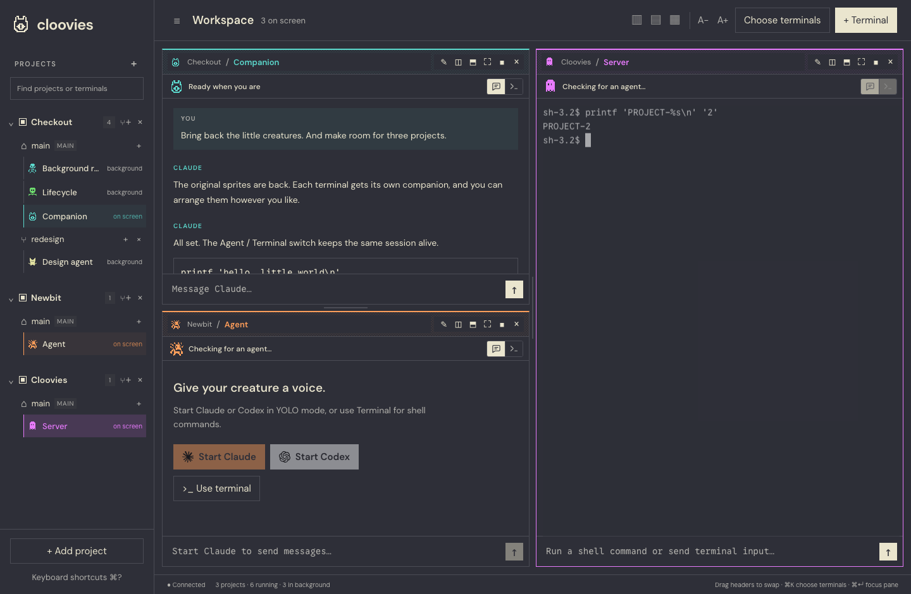

# Burrow

A local workspace for projects, Git worktrees, and persistent terminals. Put terminals from different projects on one screen, split and resize them, and keep processes running when their panes are hidden or the app is closed.

The workspace pairs DM Sans for the UI with Google Sans Code for terminals and code. Bitwise’s creatures, dithered borders, and per-terminal color palette keep their character; click a pane’s creature to customize its color and companion. Fonts are bundled locally and work offline. The original dashboard and integrations remain in the source tree; see [docs/LEGACY-DASHBOARD.md](docs/LEGACY-DASHBOARD.md).



The repository uses **Burrow** as a working name. The current app bundle and compatibility identifiers still use Cloovies.

## Download and setup

Download the app from [Releases](https://github.com/GijoRibeiro/burrow/releases). It runs on Apple Silicon and Intel Macs with macOS 13 or newer. First-run setup offers installation of Git and tmux, plus optional Claude Code and Codex. Each person signs in with their own accounts. See [installation and sharing instructions](docs/INSTALL.md), including the first-open step for this unnotarized build.

To produce the shareable ZIP yourself, run `make workspace-package`. The archive contains the app and setup instructions, without personal workspace data.

## Run

On macOS, open `build/macos/Cloovies.app` after building with:

```sh
make workspace-app
```

This produces a standalone universal macOS app with its server and web assets embedded. It needs Git and tmux at runtime; Claude, Codex, and other agent CLIs are optional. Build requirements: Go 1.26.1+, Node 20.19+ (or 22.12+), npm, and Xcode Command Line Tools.

For the browser:

```sh
make build-workspace
./bin/cloovies-workspace --port 4340
# Open http://127.0.0.1:4340
```

For frontend development:

```sh
# Terminal 1
make workspace
# Terminal 2
cd web
CLOOVIES_BACKEND_URL=http://127.0.0.1:4340 npm run dev
```

## Working in the workspace

1. **Add project**: choose a Git repository with the native folder picker, or enter its path. Existing worktrees are discovered automatically, including worktrees created outside Cloovies. Adding a linked worktree resolves to its parent project.
2. **Create worktree**: use the project's **+** button. Choose Manual or **From Linear** to search your tickets, select one, and prefill an editable branch name. Linear links remain with the worktree; new agent drafts include the ticket context. For manual creation, give it a name and a starting branch or commit. New worktrees live in `<project>/.worktrees/<name>` on a branch with the same name. The folder is excluded through Git's local `info/exclude`; the committed `.gitignore` is unchanged.
3. **New terminal**: choose any project/worktree and a session name. Choose **Claude Code** (the default), **Codex**, or **Shell**. Both agents start in YOLO mode, including after restart. Codex opens its native CLI in Terminal view.
4. **Choose terminals**: show or hide sessions from across all projects. Project selection does not replace the visible canvas. Use a pane's split buttons to add another terminal to its right or below.
5. Drag dividers to resize. Double-click a divider to balance it. Drag one header onto another to swap panes. Columns, rows, and grid presets arrange all visible terminals. Focus mode temporarily enlarges one pane.
6. Each pane has an **Agent / Terminal** switch. Agent shows Claude’s conversation without tool payloads. If no agent is running, **Start Claude** opens an agent in that pane and keeps the original shell available in the sidebar. Chat uses a separate endpoint that checks for a foreground Claude process before sending. Terminal mode explicitly accepts shell commands and other terminal input. The creature animates while Claude works. Click its header sprite to choose a color and companion. New terminals get distinct colors and randomized creatures, preferring unused creatures. View choice, color, creature, and drafts survive hide/show and reload.
7. Agent view renders local PNG, JPEG, GIF, and WebP references as thumbnails. Click a thumbnail to enlarge it, choose Fit or Actual size, and press Escape to close. Images must be inside the terminal’s checkout.
8. Type in the terminal directly, or use its message input. Enter sends; Shift+Enter inserts a newline. Scroll in the terminal for history, and press Q to leave history mode. Hold Shift while dragging to select terminal text, then copy normally.

Right-click a sidebar terminal for Show/Hide, Focus, Rename, Terminate, and (when stopped) Start or Remove. Right-click a project heading to create a worktree, start a terminal, or remove the project from the workspace. Right-click a checkout row for its actions too: the main checkout offers removal of the project from the workspace; linked worktrees offer removal of that checkout from disk, retaining the branch. The **MAIN** badge identifies the main checkout, while the adjacent name is its current branch. The heading’s **+** creates a worktree. Shift+F10 opens the same menus from the keyboard; arrows navigate and Escape closes.

**Hide** only removes the pane from view. **Stop** ends its shell and running processes after confirmation. **Start** opens a fresh shell in a stopped or exited session. Removing a worktree refuses dirty checkouts and worktrees with active terminal sessions; removing a project never deletes its files.

Tab moves to the next visible pane; Shift+Tab moves to the previous one, wrapping around. This also works in focused view. Dialogs retain normal Tab navigation.

macOS shortcuts: Cmd+K opens the terminal picker, Cmd+Shift+N creates a terminal, Cmd+B toggles the sidebar, Cmd+Enter focuses a pane, and Cmd+1–9 selects a visible pane. Linux uses Ctrl+Shift for application shortcuts, leaving ordinary Ctrl keys available to the shell.

## Optional teamwork

Ask a **Head agent** to work on your Linear tickets and it starts one worker
and terminal per ticket immediately. Discuss scope in its terminal whenever you need to. **Team canvas** shows
heads branching into workers; click a creature to talk, or switch to **Terminals**
to keep your familiar split layout. The head can read worker questions and send
replies while supervising. Use **Active agents only** for a quieter sidebar.


Right-click a checkout to **Create child worktree…**, or right-click an agent to **Delegate task…**. Delegation starts Claude or Codex in an independent child checkout with task context. Use **Tasks and inbox** to read messages, reply, follow status, and review completed changes before explicitly integrating them into the parent. Existing agents can opt in using the panel's connection instructions. Messages are persistent and read when agents check their inbox; ordinary terminals and worktrees continue to work independently.

See [the teamwork guide](docs/COORDINATION.md) for the CLI, integration safeguards, and delivery behavior.

For development app replacements while agents are running, follow the
[macOS update procedure](docs/MACOS-UPDATES.md) to preserve sessions without
creating repeated folder permission prompts.

## Persistence and boundaries

- Project and terminal metadata: `~/.cloovies/workspace.json`, saved atomically.
- Shell processes and history: a dedicated tmux server named `cloovies-workspace`. It does not attach to or kill Orca's or other apps' sessions.
- Visible layout, pane view choices, creatures, unsent message drafts, and terminal font size: the browser/webview's local storage. Native and browser layouts are independent.
- Closing or restarting Cloovies preserves shells. Rebooting the computer ends processes; the saved sessions can then be started again.
- The server listens only on loopback. Workspace requests require a local host and same-origin requests; mutations require JSON.
- The native app uses port 4340. Its log is `~/Library/Logs/Cloovies/workspace.log`. `CLOOVIES_NATIVE_PORT` can select a different native port.
- Tests use separate folders and tmux sockets. For another isolated instance, set both `CLOOVIES_WORKSPACE_DIR` and `CLOOVIES_TMUX_SOCKET`.

See the [Orca comparison and naming ideas](docs/ORCA-COMPARISON.md) for current feature gaps.

## Code and verification

The new implementation lives in `internal/workspace`, `web/src/workspace`, `cmd/workspace`, and `app/workspace.swift`. See [docs/WORKSPACE.md](docs/WORKSPACE.md) for the data model and transport details.

```sh
go test ./...
go test -race ./internal/workspace
python3 scripts/test-workspace-installer.py
cd web
npm ci
npm run build
npm test
npm run test:workspace
npm run test:e2e
npm audit
```

The workspace browser suite runs against real temporary Git repositories and tmux processes. It covers three projects on one canvas, direct terminal input, the message composer, resizing, layout restoration, worktree creation, hide/show, focus, rename, stop/start, reconnects, scrollback, and exited-shell restart. Go integration tests also recreate the server and verify that shell state survives. The retro journey exercises mixed views, creature selection, transcript filtering, thinking/idle states, interactive prompts, view persistence, and compact panes.

The legacy entry points (`cmd/bitwise`, `cmd/clooviesd`) serve the new workspace at `/` and preserve the original agent dashboard at `/legacy.html`. The standalone workspace server intentionally does not run the legacy agent services.

Text controls apply to both views: **A+ / A−**, **⌘+ / ⌘−**, and **⌘0** to reset. Pane changes, sidebar toggles, and project groups animate, respecting reduced-motion preferences. Terminal view retains the CLI’s own ANSI colors and formatting with the workspace background.
